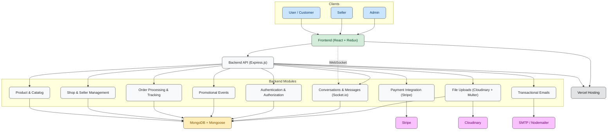
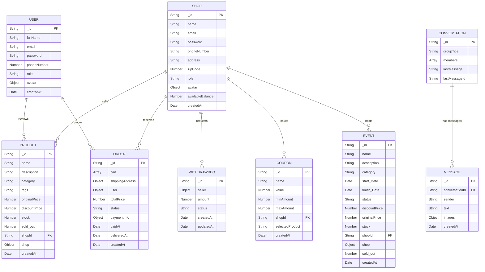
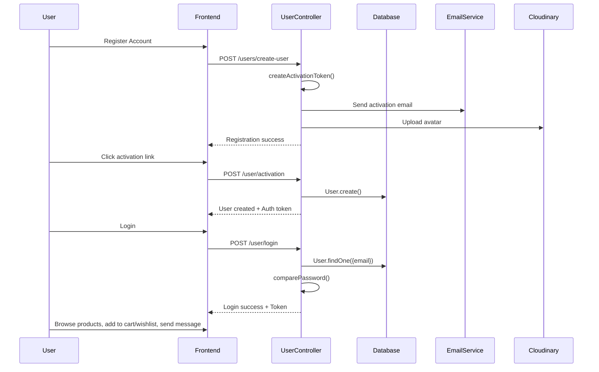
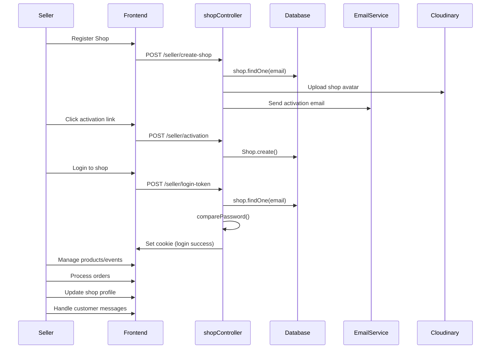
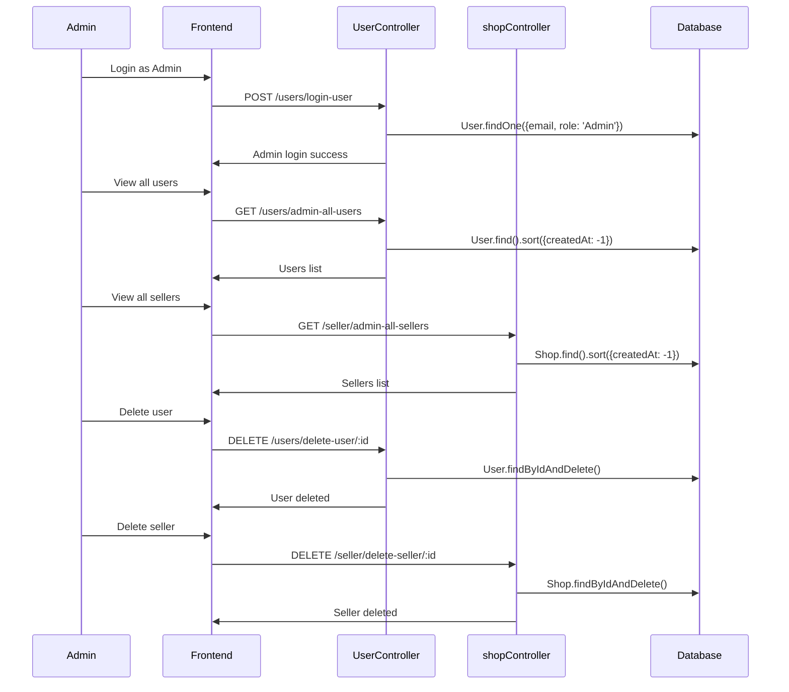

# Trendora – Multi-Vendor E-Commerce Platform

## Overview
**Trendora** is a scalable and interactive multi-vendor e-commerce platform designed to connect **customers**, **sellers**, and **administrators** in a unified marketplace.  

It allows customers to explore product catalogs, participate in promotions, place secure orders, and communicate with sellers in real-time.  
Sellers can create online shops, manage products, fulfill orders, and analyze performance.  
Administrators monitor platform health, manage users and vendors, and ensure data integrity.  

The platform integrates **real-time messaging**, **secure payment processing (Stripe)**, **cloud-based media storage**, and **automated email notifications**, delivering a complete and responsive e-commerce experience.

---

## Goals of the Project
- Build a **modern, scalable, and interactive marketplace**.  
- Enable multiple vendors to manage shops independently.  
- Provide customers with seamless product browsing, wishlist, cart management, and order tracking.  
- Facilitate real-time communication between buyers and sellers.  
- Ensure secure authentication, responsive design, and a reliable platform for all users.  

---

## Key Features
- **Role-Based User System:** Customers, sellers, and admins have dedicated dashboards and workflows.  
- **Product Catalog & Shopping:** Advanced search, category-based navigation, cart management, and wishlist.  
- **Payments:** Stripe integration for secure transactions.  
- **Messaging:** Real-time chat between buyers and sellers with text/image support.  
- **Seller Tools:** Revenue tracking, order management, product analytics, and discount codes.  
- **API Endpoints:** Organized by functional areas for users, sellers, products, orders, payments, and messaging.  
- **Responsive Design:** Works seamlessly on desktop, tablet, and mobile devices.  
- **Animations:** Built with **Framer Motion** for smooth UI transitions.  

---

## Technology Stack
| Layer | Technology Stack | Purpose / Functionality |
|-------|-----------------|------------------------|
| Frontend | React 18 + Vite | Fast, responsive, and animated user interface |
| State Management | Redux Toolkit | Efficient global state management |
| Backend | Express.js | Handles RESTful API requests and server-side logic |
| Database | MongoDB + Mongoose | Flexible, document-based data storage |
| Real-Time Communication | Socket.io | Instant messaging and live updates |
| Authentication | JWT + bcrypt | Secure, token-based authentication |
| Payment Gateway | Stripe | Processes online payments securely |
| File Storage | Cloudinary + Multer | Handles product image uploads and media storage |
| Email Service | Nodemailer | Sends transactional and notification emails |
| Deployment | Vercel | Frontend and backend hosting |

---

## System Architecture Overview
**Trendora** follows a modern full-stack architecture optimized for performance, scalability, and real-time interactions.  
- Frontend: React with Framer Motion for smooth animations and responsive design.  
- Backend: Express.js REST APIs with role-based authorization.  
- Database: MongoDB with Mongoose schemas for users, sellers, products, orders, chats, and events.  
- Real-Time: Socket.io for messaging and notifications.  
- Payment: Stripe for secure transactions.  
- Deployment: Vercel for production hosting.  

**System Architecture Diagram:**  

---

## Database Design
- Structured around **users, shops, products, orders, messages, reviews, coupons, events, and withdraw requests**.  
- Relations implemented via **foreign keys** and embedded documents.  
- Ensures data integrity and scalability.  

**Database ER Diagram:**  

---

## Application Flows
### User Flow
- Browse products, search and filter.
- Add to cart or wishlist.
- Make Stripe payments.
- Track order status.
- Communicate with sellers via chat.

### Seller Flow
- Create and customize shop.
- Add/edit products.
- Process and fulfill orders.
- Analyze revenue and product performance.
- Manage discount codes.

### Admin Flow
- Monitor platform activity.
- Manage users, sellers, and products.
- Ensure security and data integrity.
- Oversee reports and notifications.

## Application Flow Diagram

```mermaid
flowchart TB
    %% Frontend Layer
    subgraph FrontendLayer["Frontend Layer"]
        subgraph UserInterface["User Interface"]
            CustomerUI["Customer Interface<br/>- Product Discovery<br/>- Cart Management<br/>- Checkout Process"]
            SellerUI["Seller Dashboard<br/>- Product Management<br/>- Order Processing<br/>- Messaging"]
            AdminUI["Admin Panel<br/>- User Management<br/>- System Oversight"]
        end
        
        subgraph ReactComponents["React Components"]
            ProductDetails["ProductDetails Component"]
            UserInbox["UserInbox Component"]
            DashboardMessages["DashboardMessages Component"]
        end
        
        subgraph StateManagement["State Management"]
            ReduxStore["Redux Store<br/>- User State<br/>- Product State<br/>- Cart/Wishlist"]
        end
    end
    
    %% Communication Layer
    subgraph CommunicationLayer["Communication Layer"]
        HTTPREST["HTTP/REST"]
        CORS["CORS Middleware<br/>Credentials: true"]
        Auth["JWT Cookie Authentication"]
        SocketIO["Socket.io WebSocket<br/>socket-server-89h0.onrender.com"]
    end
    
    %% Backend Layer
    subgraph BackendLayer["Backend Layer"]
        ExpressServer["Express.js Server<br/>API Gateway Port 5000"]
        subgraph RouteModules["Route Modules"]
            UserRoutes["/api/v2/user/*<br/>Authentication & Profiles"]
            SellerRoutes["/api/v2/seller/*<br/>Shop Management"]
            ProductRoutes["/api/v2/product/*<br/>Catalog Operations"]
            OrderRoutes["/api/v2/order/*<br/>Order Processing"]
            ConversationRoutes["/api/v2/conversation/*<br/>Chat Management"]
            MessageRoutes["/api/v2/messages/*<br/>Message Operations"]
            PaymentRoutes["/api/v2/payment/*<br/>Stripe Integration"]
            CouponRoutes["/api/v2/coupons/*<br/>Coupons"]
            EventRoutes["/api/v2/events/*<br/>Events"]
            WithdrawRoutes["/api/v2/withdraw-request/*<br/>Withdraw Requests"]
        end
    end
    
    %% Data Layer
    subgraph DataLayer["Data Layer"]
        MongoDB["MongoDB Database<br/>Document Storage"]
        Cloudinary["Cloudinary<br/>Image Storage"]
        Stripe["Stripe API<br/>Payment Processing"]
    end
    
    %% Connections: Frontend -> Communication
    CustomerUI --> CORS
    SellerUI --> CORS
    AdminUI --> CORS
    
    ProductDetails --> ReduxStore
    UserInbox --> SocketIO
    DashboardMessages --> SocketIO
    
    %% Connections: Communication -> Backend
    CORS --> Auth
    Auth --> ExpressServer
    SocketIO -.-> MessageRoutes
    
    %% Connections: Backend -> Routes
    ExpressServer --> UserRoutes
    ExpressServer --> SellerRoutes
    ExpressServer --> ProductRoutes
    ExpressServer --> OrderRoutes
    ExpressServer --> ConversationRoutes
    ExpressServer --> MessageRoutes
    ExpressServer --> PaymentRoutes
    ExpressServer --> CouponRoutes
    ExpressServer --> EventRoutes
    ExpressServer --> WithdrawRoutes
    
    %% Connections: Backend -> Data
    UserRoutes --> MongoDB
    SellerRoutes --> MongoDB
    ProductRoutes --> MongoDB
    OrderRoutes --> MongoDB
    ConversationRoutes --> MongoDB
    MessageRoutes --> MongoDB
    MessageRoutes --> Cloudinary
    PaymentRoutes --> Stripe
    CouponRoutes --> MongoDB
    EventRoutes --> MongoDB
    WithdrawRoutes --> MongoDB
    
    %% Real-time Flow
    UserInbox -.->|"Real-time Messages"| DashboardMessages

```

---

## User Flow

---
## Seller Flow

---

## Admin Flow

---

## Challenges & Solutions
| Challenge | Solution |
|-----------|---------|
| Sign-up token expired | Adjusted React Strict Mode to prevent token re-render issues |
| Database schema modeling errors | Reviewed and corrected Mongoose schemas and relationships |
| Redux state not updating | Implemented proper async actions and slices in Redux Toolkit |
| Stripe integration issues | Debugged using Stripe sandbox environment before production |
| Image uploading issues | Transitioned from local uploads to Cloudinary |
| Production errors with Vercel | Adjusted deployment configs, set environment variables correctly |
| LocalStorage management | Implemented reliable get/set logic with JSON parsing |
| Data fetching & UI rendering | Used proper API calls with error handling and React hooks |
| Middleware issues | Configured Express middlewares for authentication, error handling, and parsing |

---

## Best Practices
- **Authentication & Security:** JWT tokens in HTTP-only cookies, bcrypt password hashing, role-based authorization.  
- **Component Architecture & Responsiveness:** Modular React components, clean state management, protected routes, responsive UI for all devices.  
- **Error Handling & UX:** Graceful error handling, stock validation, notifications for user actions, and prevention of duplicates in the cart.  
- **Animations:** Use Framer Motion to provide smooth transitions and a polished user experience.

---

## Conclusion
**Trendora** is a production-ready, feature-rich, and scalable multi-vendor e-commerce platform.  
It combines **technical robustness**, **responsive design**, **secure authentication**, and **interactive features** to deliver a seamless experience for customers, sellers, and administrators.  
The platform is designed for real-world deployment and future growth, ensuring reliability, scalability, and engagement.

